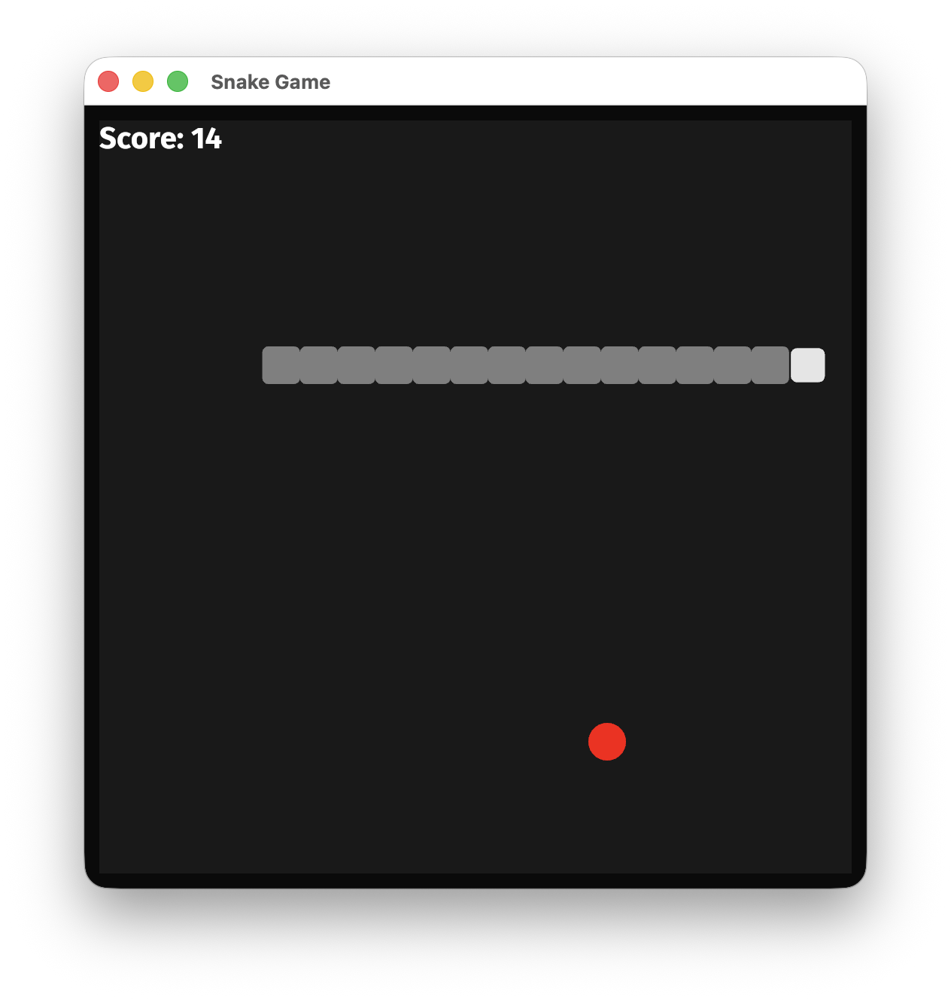

# Snake Game in Rust with Bevy

A simple Snake game implemented in Rust using the Bevy game engine, initially written entirely by _Claud Desktop_ with _Desktop Commander MCP_. Later updates were made using _Claude Code_. 




## Features

- Classic Snake gameplay mechanics
- Score tracking
- Game over state with restart functionality
- Wrap-around screen edges

## Controls

- Arrow keys or WASD to control the snake
- Space to restart after game over

## How to Run

1. Make sure you have Rust and Cargo installed:
   ```bash
   curl --proto '=https' --tlsv1.2 -sSf https://sh.rustup.rs | sh
   ```

2. Navigate to the project directory and run the game:
   ```bash
   cargo run --release
   ```

## Game Rules

- Control the snake to eat the red food dots
- Each food item increases your score and makes the snake longer
- The game ends if the snake collides with itself
- The snake can wrap around the edges of the screen

## Dependencies

- Rust 1.91.1
- Bevy 0.17.3
- rand 0.9.2

## Project Structure

- `src/main.rs`: Contains all game code
- `assets/fonts/`: Contains font files for text rendering
