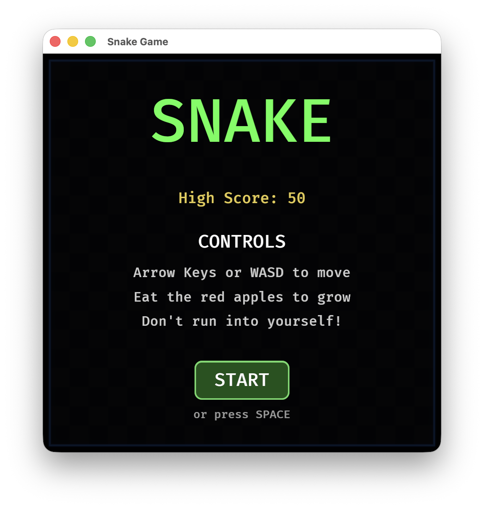
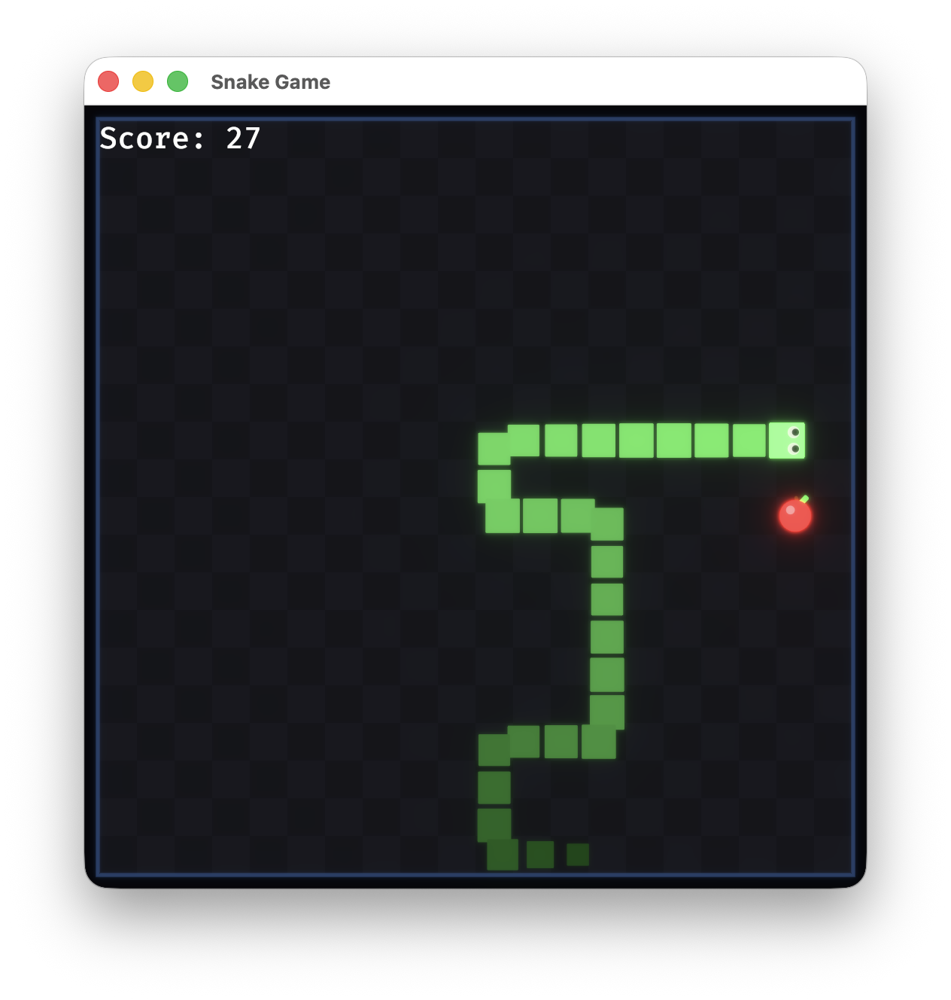
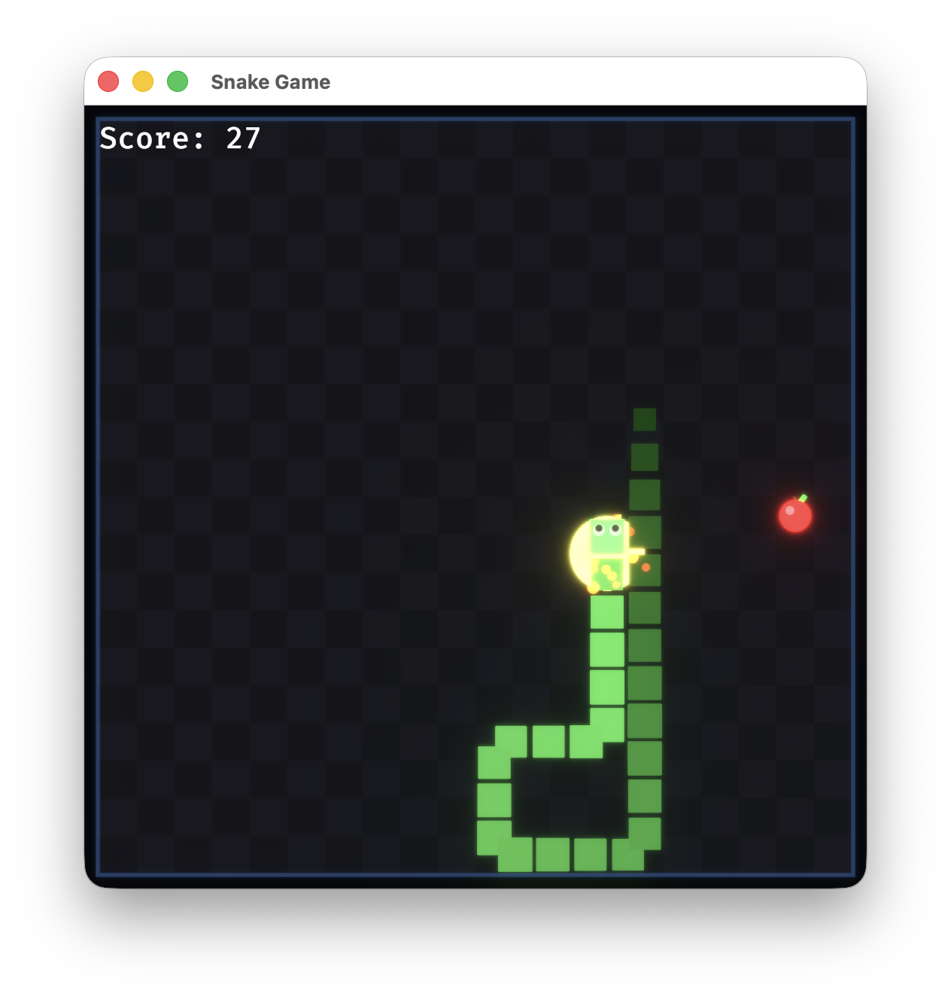

# Snake Game in Rust with Bevy

A simple Snake game implemented in Rust using the Bevy game engine, initially written entirely by _Claud Desktop_ with _Desktop Commander MCP_. Later updates were made using _Claude Code_.





## Features

- Classic Snake gameplay mechanics
- Score tracking with a persistent high score (saved across sessions)
- Glowing HDR + bloom visuals: gradient snake body with tail taper, blinking eyes, and a flicking tongue
- Apples with a pop-in animation; eating them bursts juice particles and a floating "+1"
- Start menu and game-over/win screens with clickable buttons
- Wrap-around screen edges

## Controls

- Arrow keys or WASD to control the snake
- Click START / RESTART / PLAY AGAIN, or press Space

## How to Run

1. Make sure you have Rust and Cargo installed:
   ```bash
   curl --proto '=https' --tlsv1.2 -sSf https://sh.rustup.rs | sh
   ```

2. Navigate to the project directory and run the game:
   ```bash
   cargo run --release
   ```

## Game Rules

- Control the snake to eat the red apples
- Each apple increases your score and makes the snake longer
- The game ends if the snake collides with itself
- The snake can wrap around the edges of the screen
- Fill the entire arena to win

## Dependencies

- Rust 1.96
- Bevy 0.19
- bevy_vector_shapes 0.13
- rand 0.10

## Project Structure

- `src/main.rs`: App setup and plugin wiring
- `src/game/`: Shared components, resources, events, constants, and system sets
- `src/snake/`: Snake movement, input, growth, and body styling
- `src/food/`: Apple spawning, collision, and animations
- `src/rendering/`: Position interpolation, visual effects, and camera shake
- `src/ui/`: Menus, end screens, score HUD, and game flow (BSN scenes)
